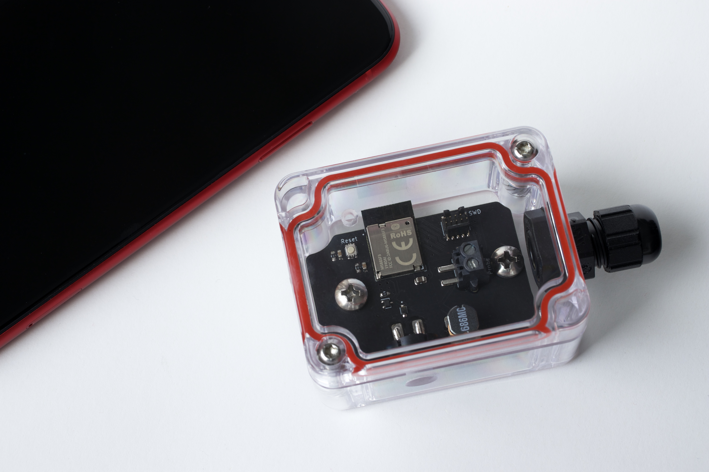
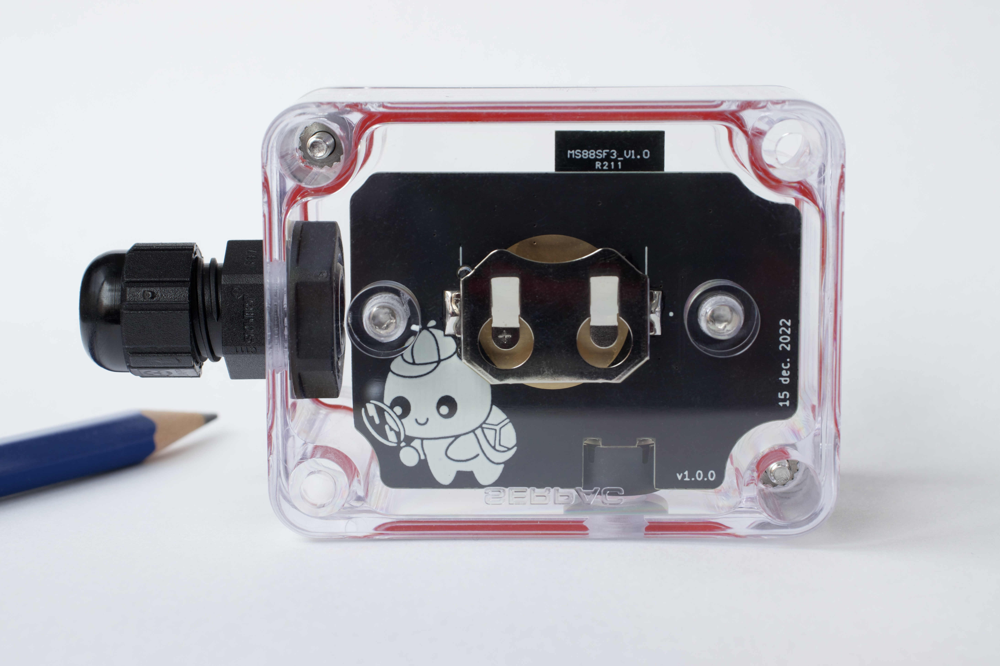
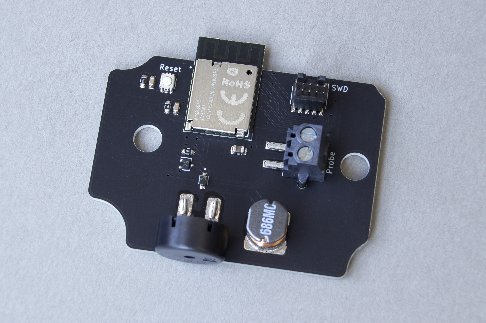
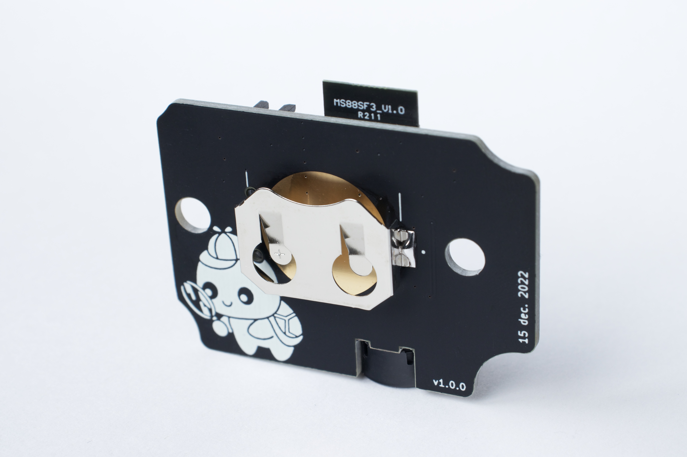
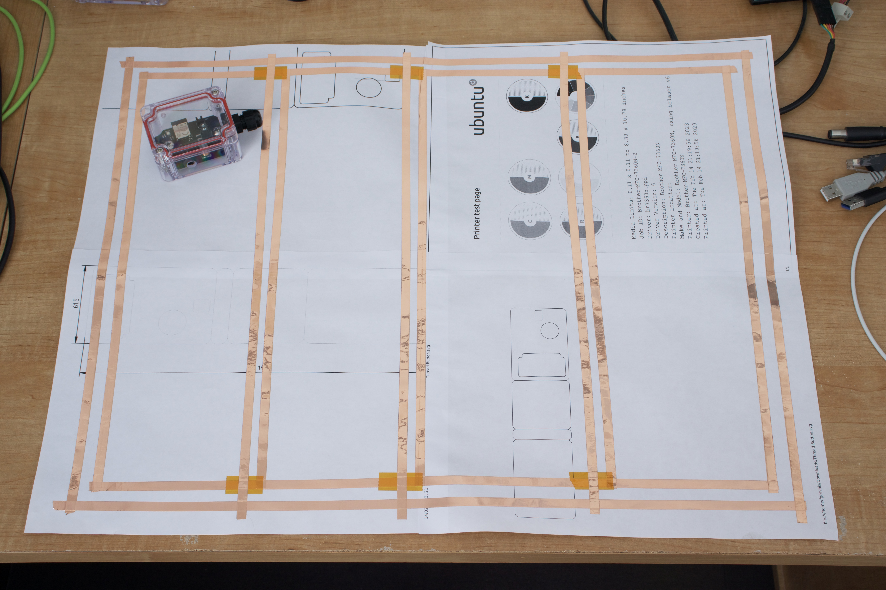
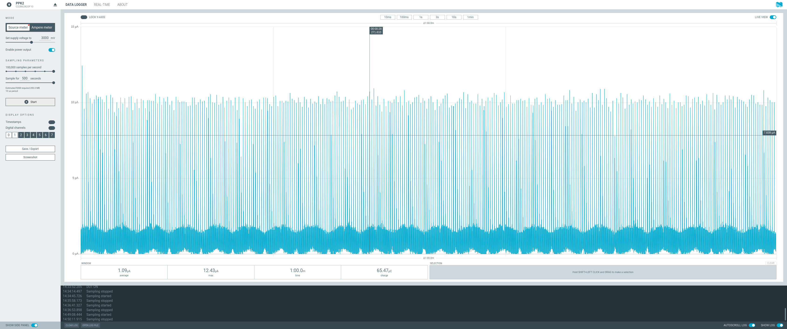
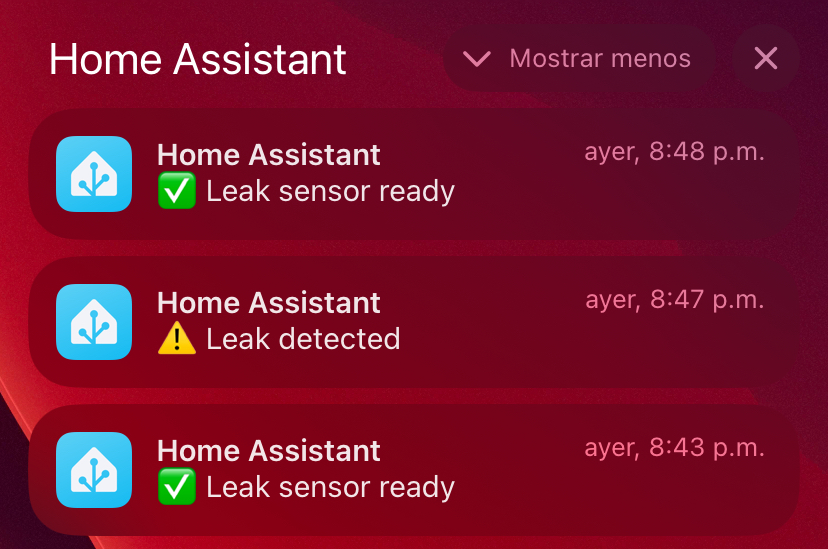

# Leak Detector, revision 3

Any two conductors can be connected to the screw terminals and the alarm will 
start if water shorts them out.

- [Complete Project](#complete-project)
- [PCB](#pcb)
- [Water Probe](#water-probe)
- [Power Consumption](#power-consumption)
- [Firmware](#firmware)
- [Notifications](#notifications)

## Complete Project

### Front side



### Back side



## PCB

### Front side



### Back side



## Water Probe



## Power Consumption

Based on revision [`8f98e931fbc428e85092b7998ec07682605cf380`](https://github.com/fgervais/project-nrf-leak-detector/tree/8f98e931fbc428e85092b7998ec07682605cf380/app/src).

### Idle



How long can the device monitor for a leak?

- Energizer CR2032 = $810 \\, C$
- Idle consumption = $1.09 \\, \frac{{\mu}C}{s}$

```math
\frac{810 \, C}{1.09 \times 10^-6 \, \frac{C}{s}} = 743.119 \times 10^6 \, s
```

```math
470.93 \times 10^6 \, seconds \times \frac{1 \, minute}{60 \, second} \times \frac{1 \, hour}{60 \, minute} \times \frac{1 \, day}{24 \, hour} \times \frac{1 \, year}{365.25 \, days} = 23 \, years
```

Note: This does not account for the battery self discharge and the battery voltage
going down over time.

### Alarm


## Firmware

https://github.com/fgervais/project-nrf-leak-detector

## Notifications

When a leak is detected, the information is sent to Home Assistant tough MQTT
which sends notifications to computers and mobile devices.

A notification is also sent when the leak detector is reset and rearmed to let
the user know that the leak monitoring is functioning correctly.


