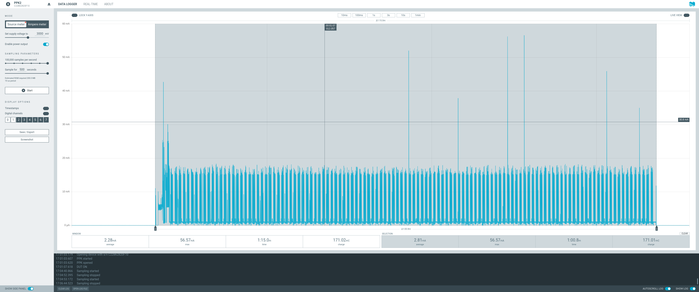

# Leak Detector, revision 3

- [Complete Project](#complete-project)
- [PCB](#pcb)
- [Power Consumption](#power-consumption)
- [Firmware](#firmware)

## Complete Project

### Front side


### Back side


## PCB

### Front side


### Back side


## Power Consumption

Based on revision [`ff65151e477efaec1259688cf5fb03853c3a1412`](https://github.com/fgervais/project-nrf-leak-detector/tree/ff65151e477efaec1259688cf5fb03853c3a1412/app/src).

### Idle


How long can the device monitor for a leak?

- Energizer CR2032 = $810 \\, C$
- Idle consumption = $1.72 \\, \frac{{\mu}C}{s}$

```math
\frac{810 \, C}{1.72 \times 10^-6 \, \frac{C}{s}} = 470.93 \times 10^6 \, s
```

```math
470.93 \times 10^6 \, seconds \times \frac{1 \, minute}{60 \, second} \times \frac{1 \, hour}{60 \, minute} \times \frac{1 \, day}{24 \, hour} \times \frac{1 \, year}{365.25 \, days} = 14.92 \, years
```

Note: This does not account for the battery self discharge and the battery voltage
going down over time.

### Alarm



## Firmware

https://github.com/fgervais/project-nrf-leak-detector
